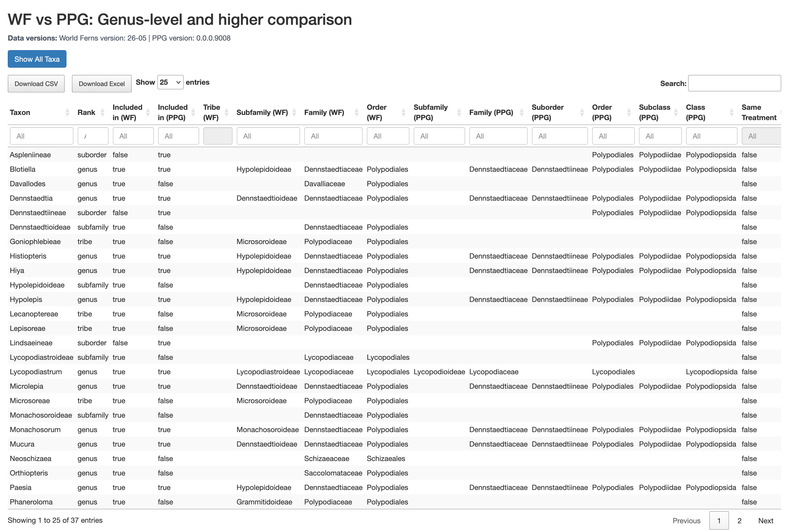

**[World Ferns](https://www.worldplants.de/world-ferns/ferns-and-lycophytes-list)** is an another taxonomic database for ferns and lycophytes, and contributed to the initial seeding of the PPG data.

To facilitate easy comparison between PPG and WF data, we have set up a web-app that compares the two (@fig-comparison).

[Click here](https://pteridogroup.shinyapps.io/ppg-wf-explorer/){target="_blank"} to open the app.

Please note that the server has extremely limited bandwidth and may be slow or inaccessible.

{#fig-comparison}
